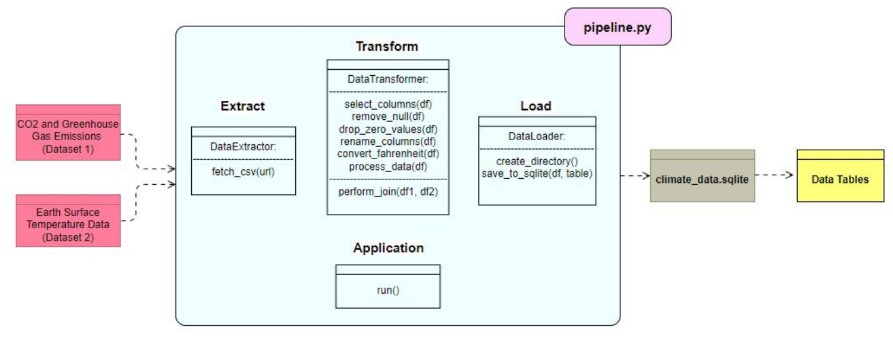

# Exercise Badges

    

# Climate Confluence: Analyzing the Impact of CO2 Emissions on Global Temperature Trends

## Project Overview
This project, "Climate Confluence: Analyzing the Impact of CO2 Emissions on Global Temperature Trends," examines the correlation between CO2 emissions and global temperature changes. The study utilizes datasets on CO2 emissions and global temperatures to explore this relationship, aiming to provide evidence for effective climate change strategies.

## Contents
- [Introduction](#introduction)
- [Datasets](#datasets)
- [Data Pipeline](#data-pipeline)
- [Project Setup](#project-setup)
- [Analysis and Results](#analysis-and-results)
- [License](#license)
- [Acknowledgments](#acknowledgments)

## Introduction
The primary objective of this project is to understand how CO2 emissions influence global temperatures. By analyzing historical data, we aim to identify trends and correlations that highlight the impact of CO2 emissions on global warming.

## Datasets
We have used two main datasets for this analysis:
1. **CO2 and Greenhouse Gas Emissions Dataset**
   - **Metadata URL:** [GitHub Repository](https://github.com/owid/co2-data/tree/master)
   - **Data URL:** [Download CSV](https://nyc3.digitaloceanspaces.com/owid-public/data/co2/owid-co2-data.csv)
2. **Earth Surface Temperature Data**
   - **Metadata URL:** [Figshare](https://figshare.com/articles/dataset/temperature_csv/3171766/1)
   - **Data URL:** [Download CSV](https://figshare.com/ndownloader/files/4938964)

## Data Pipeline
The project follows an ETL (Extract, Transform, Load) pipeline to process the data:

<figure align="center" style="width:100%">
    
    <figcaption>Figure: ETL Pipeline</figcaption>
</figure>


1. # **Extract**
   - Fetches CSV data from specified URLs.
2. **Transform**
   - Cleans and preprocesses the data, including handling null values, converting temperatures from Fahrenheit to Celsius, and renaming columns.
3. **Load**
   - Saves the processed data into an SQLite database.


## Project Setup
To set up this project, follow these steps:

1. **Clone the Repository:**
   ```sh
   git clone https://github.com/AnikKazi-dev/Kazi_MADE.git
   cd Kazi_MADE

## License
This project is licensed under the MIT License. See the [LICENSE](LICENSE) file for more details.

## Acknowledgments
This project was conducted by Kazi Anik Islam at Friedrich-Alexander-Universität Erlangen-Nürnberg in a course named Methods of Advanced Data Engineering. Special thanks to the providers of the CO2 emissions and temperature datasets.


# Methods of Advanced Data Engineering Template Project

This template project provides some structure for your open data project in the MADE module at FAU.
This repository contains (a) a data science project that is developed by the student over the course of the semester, and (b) the exercises that are submitted over the course of the semester.
Before you begin, make sure you have [Python](https://www.python.org/) and [Jayvee](https://github.com/jvalue/jayvee) installed. We will work with [Jupyter notebooks](https://jupyter.org/). The easiest way to do so is to set up [VSCode](https://code.visualstudio.com/) with the [Jupyter extension](https://marketplace.visualstudio.com/items?itemName=ms-toolsai.jupyter).

To get started, please follow these steps:

1. Create your own fork of this repository. Feel free to rename the repository right after creation, before you let the teaching instructors know your repository URL. **Do not rename the repository during the semester**.
2. Setup the exercise feedback by changing the exercise badge sources in the `README.md` file following the patter ``.
   For example, if your user is _myuser_ and your repo is _myrepo_, then update the badge for _exercise 1_ to ``. Proceed with the remaining badges accordingly.

## Project Work

Your data engineering project will run alongside lectures during the semester. We will ask you to regularly submit project work as milestones so you can reasonably pace your work. All project work submissions **must** be placed in the `project` folder.

### Exporting a Jupyter Notebook

Jupyter Notebooks can be exported using `nbconvert` (`pip install nbconvert`). For example, to export the example notebook to html: `jupyter nbconvert --to html examples/final-report-example.ipynb --embed-images --output final-report.html`

### Exercise Feedback

We provide automated exercise feedback using a GitHub action (that is defined in `.github/workflows/exercise-feedback.yml`).

To view your exercise feedback, navigate to Actions -> Exercise Feedback in your repository.

The exercise feedback is executed whenever you make a change in files in the `exercise` folder and push your local changes to the repository on GitHub. To see the feedback, open the latest GitHub Action run, open the `exercise-feedback` job and `Exercise Feedback` step. You should see command line output that contains output like this:

```sh
Found exercises/exercise1.jv, executing model...
Found output file airports.sqlite, grading...
Grading Exercise 1
	Overall points 17 of 17
	---
	By category:
		Shape: 4 of 4
		Types: 13 of 13
```
